# LIRI Bot

### Overview
LIRI is like iPhone's SIRI. However, while SIRI is a Speech Interpretation and Recognition Interface, LIRI is a Language Interpretation and Recognition Interface. LIRI is be a command line node app that takes in parameters and gives you back data.

### Functionality
LIRI accomplishes several functions by using a combination of the Bands in Town Artist Events, Spotify, and OMDb APIs, with the help of several node modules. The program can do the following tasks:

1. Check for upcoming concerts and events for your favorite musical artists.

2. Look up track information for specific songs.

3. Retrieve database information for movies.

4. Run any of these functionalities by interpreting a basic .txt file.

### How to Use
* The file being used by the `dotenv` package sets what are known as environment variables to the global `process.env` object in node. These are values that are meant to be specific to the computer that node is running on, and since we are gitignoring this file, they won't be pushed to github in order to keep our API key information private.

* If you wanted to clone this app from github and run it yourself, you would need to supply your own `.env` file, containing your own API keys, for it to work.

Once you have your `.env` file ready to go, and all packages found in `package.json` installed, LIRI will be able to run the following functionalities:

1. `node liri.js concert-this <artist/band name here>`

    * This will search the Bands in Town Artist Events API for an artist and render the following information about each event to the terminal:

        * Name of the venue

        * Venue location

        * Date of the Event (use moment to format this as "MM/DD/YYYY")

    * The program will display the top 5 results:
    
    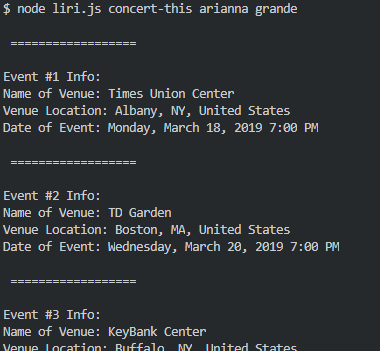

    * If the API returns no results, it will display an error message:
    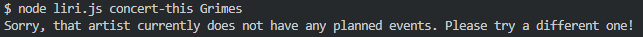

2. `node liri.js spotify-this-song '<song name here>'`

    * This will show the following information about the song in your terminal/bash window

        * Artist(s)

        * The song's name

        * The album that the song is from
    
        * A preview link of the song from Spotify

        * A link to the songs Spotify page


    * The program will display the top 5 results:
    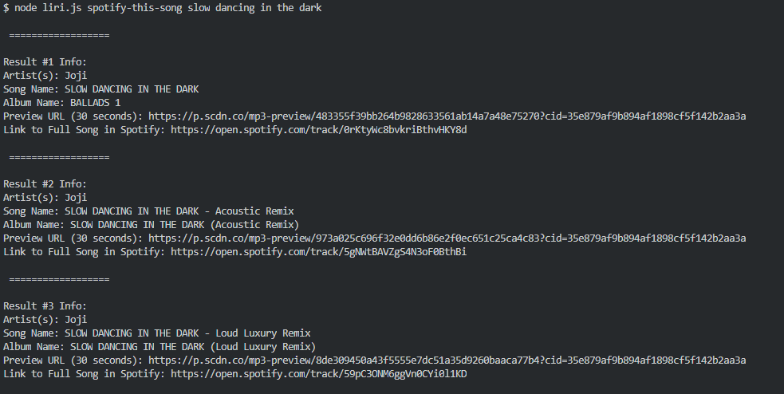

   * If no song is provided then your program will default to "The Sign" by Ace of Base.
    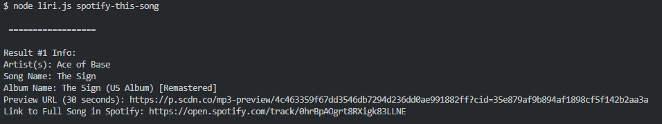

3. `node liri.js movie-this '<movie name here>'`

   * This will output the following information to your terminal/bash window:

     ```
       * Title of the movie.
       * Year the movie came out.
       * IMDB Rating of the movie.
       * Rotten Tomatoes Rating of the movie.
       * Country where the movie was produced.
       * Language of the movie.
       * Plot of the movie.
       * Actors in the movie.
     ```

    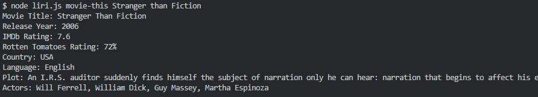

   * If the user doesn't type a movie in, the program will output data for the movie 'Mr. Nobody.'
    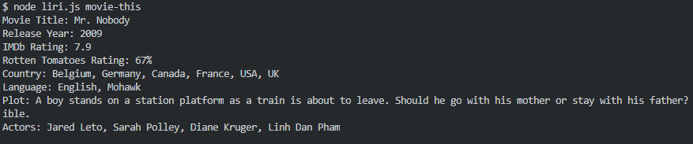

    * If the API returns no results, it will display an error message:
    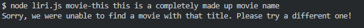

4. `node liri.js do-what-it-says`

   * Using the `fs` Node package, LIRI will take the text inside of random.txt and then use it to call one of LIRI's commands.

     * It will run `spotify-this-song` for "I Want it That Way," or any other command that follows the same syntax in `random.txt` of `<searchType>,<searchQuery>`.
        * Spotify API:

            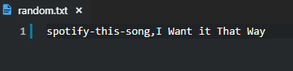
            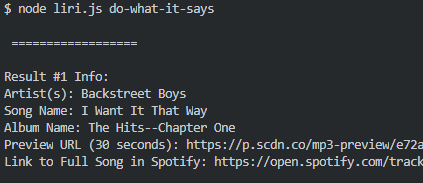
        * Bands in Town API:

            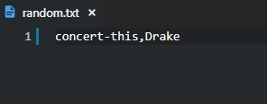

            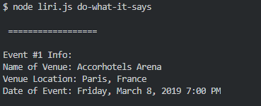
        * OMDb API:

            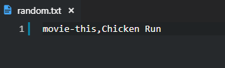
            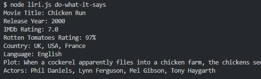
